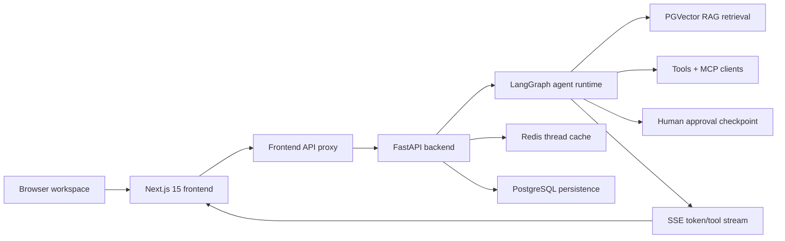
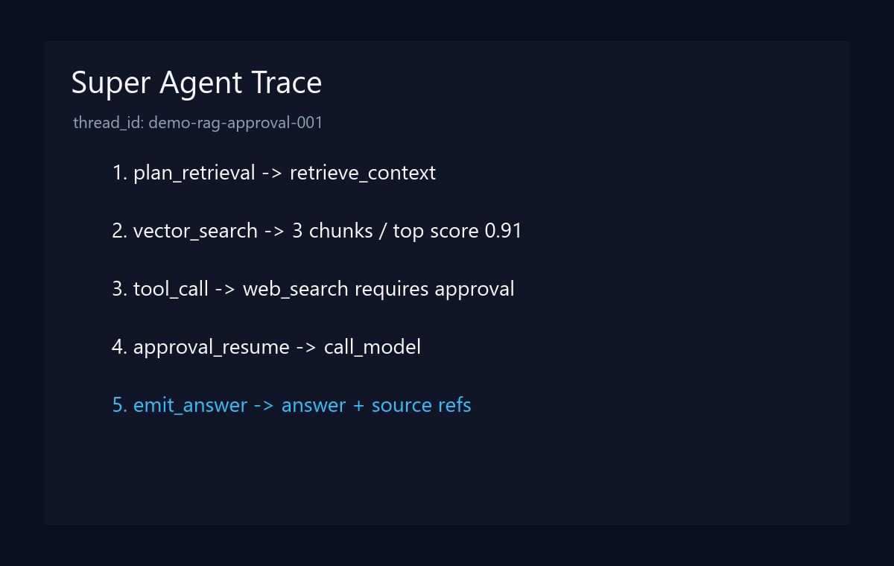

# Super Agent

Language: **English** | [中文](README.zh-CN.md)

Super Agent is an agent workspace built with `FastAPI + LangGraph + PostgreSQL/PGVector + Redis + Next.js 15`.

It combines streaming chat, tool calling, MCP integration, RAG document retrieval, human approval/resume execution, Redis thread history, and a Next.js workspace UI.

## Architecture



## Online Demo

- GitHub Pages static demo: `https://zifeiyuuuuuuu.github.io/super-agent/`
- The hosted demo keeps the workspace UI and static answer flow. RAG, MCP, approval resume, and Redis / PostgreSQL persistence still require a local or private deployment.

## Trace Screenshot



The trace view explains agent behavior: retrieval decisions, chunk scores, tool calls, approval gates, resume events, and final source references.

## Real-Model Smoke Eval

You can exercise the real OpenAI-compatible model path with:

```powershell
python tests\real_model_eval.py
```

Current saved result file: `docs/real-model-eval.qwen-plus.json`

| Metric | Current measured result | Measurement note |
| --- | ---: | --- |
| Model | `qwen-plus` | DashScope compatible-mode |
| Success rate | `3/3 (100%)` | Covers direct answering, workspace capability summary, and tool-result synthesis |
| Latency | P50 `10862.81ms`, P95 `15356.58ms` | Taken from `docs/real-model-eval.qwen-plus.json` |

## Offline Eval Harness

Run the deterministic local eval harness without model, database, Redis, or vector-store credentials:

```powershell
python tests\eval_harness.py
```

| Metric | Current portfolio baseline | Measurement note |
| --- | ---: | --- |
| Latency | P50 `1.59ms`, P95 `1.96ms` | Deterministic planner/retrieval reviewer, 3 local cases |
| RAG hit rate | `100%` | Strong retrieved chunks at `rerank_score >= 0.80` |
| Agent success rate | `100%` | Required answer terms and source refs present |
| Report generation time | `N/A` | Report/PDF route is not part of this harness yet |
| Cost | `$0.00 / eval run` | No external model calls in deterministic harness |

## Stack

- Backend: Python 3.12, FastAPI, LangGraph, PostgreSQL, PGVector, Redis, MCP, Tavily, Playwright, BeautifulSoup, ReportLab.
- Frontend: Next.js 15, React 19, TypeScript, CSS Modules, Motion, Lucide React, Lenis.

## Run

Start dependencies:

```powershell
docker compose up -d db redis
```

Start backend:

```powershell
python main.py
```

Start frontend:

```powershell
cd frontend
npm install
npm run dev
```

Default URLs:

| Service | URL |
| --- | --- |
| Frontend | `http://127.0.0.1:3100` |
| Backend | `http://127.0.0.1:8010` |

## Deployment Checklist

1. Put the app behind HTTPS, preferably `agent.yourdomain.com`.
2. Run `docker compose up -d --build` or equivalent services.
3. Set `FRONTEND_URL`, `BACKEND_URL`, `OPENAI_API_KEY`, `OPENAI_BASE_URL`, `OPENAI_MODEL`, `DATABASE_URL`, `REDIS_URL`, and tool provider keys.
4. Restrict database and Redis to the private network; expose only the reverse proxy.
5. Run `python tests\eval_harness.py` and `python test_sse.py --base-url https://agent.yourdomain.com` after deployment.
