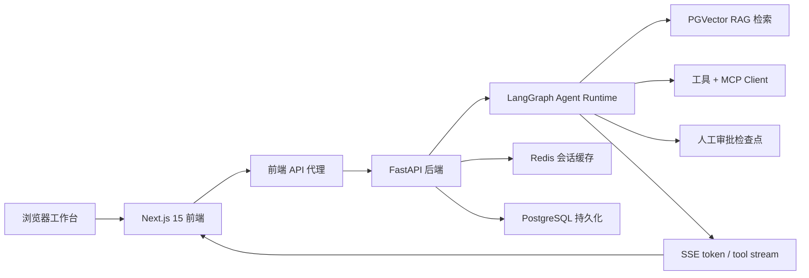

# Super Agent

语言： [English](README.md) | **中文**

Super Agent 是一个基于 `FastAPI + LangGraph + PostgreSQL/PGVector + Redis + Next.js 15` 的智能体工作台。

它把流式聊天、工具调用、MCP 接入、RAG 文档检索、人工审批/恢复执行、Redis 会话历史和 Next.js 前端工作台整合到一套应用中。

## 架构



## 线上演示

- GitHub Pages 静态演示：`https://zifeiyuuuuuuu.github.io/super-agent/`
- 这份线上演示保留了前端工作台交互和静态回复路径；RAG、MCP、审批恢复和 Redis / PostgreSQL 持久化仍以本地或私有部署为准。

## Trace 截图


Trace 视图用于解释 Agent 行为：检索决策、chunk 分数、工具调用、审批节点、恢复执行事件和最终来源引用。

## 真实模型冒烟评测

使用 OpenAI-compatible 配置的真实模型链路可运行：

```powershell
python tests\real_model_eval.py
```

当前已落盘结果：`docs/real-model-eval.qwen-plus.json`

| 指标 | 当前实测结果 | 说明 |
| --- | ---: | --- |
| 模型 | `qwen-plus` | DashScope compatible-mode |
| 成功率 | `3/3 (100%)` | 覆盖直接问答、工作台能力概括、基于工具结果总结 |
| 延迟 | P50 `10862.81ms`, P95 `15356.58ms` | 取自 `docs/real-model-eval.qwen-plus.json` |

## 离线评估 Harness

无需模型、数据库、Redis 或向量库凭据即可运行本地确定性 eval harness：

```powershell
python tests\eval_harness.py
```

| 指标 | 当前作品集 baseline | 说明 |
| --- | ---: | --- |
| 延迟 | P50 `1.59ms`, P95 `1.96ms` | 确定性 planner / retrieval reviewer，3 个本地案例 |
| RAG 命中率 | `100%` | 强证据 chunk 的 `rerank_score >= 0.80` |
| Agent 成功率 | `100%` | 必要答案项和来源引用都存在 |
| 报告生成耗时 | `N/A` | 报告/PDF 路由尚未纳入该 harness |
| 成本 | `$0.00 / eval run` | 确定性 harness 不调用外部模型 |

## 技术栈

- 后端：Python 3.12、FastAPI、LangGraph、PostgreSQL、PGVector、Redis、MCP、Tavily、Playwright、BeautifulSoup、ReportLab。
- 前端：Next.js 15、React 19、TypeScript、CSS Modules、Motion、Lucide React、Lenis。

## 运行

启动依赖：

```powershell
docker compose up -d db redis
```

启动后端：

```powershell
python main.py
```

启动前端：

```powershell
cd frontend
npm install
npm run dev
```

默认地址：

| 服务 | 地址 |
| --- | --- |
| 前端 | `http://127.0.0.1:3100` |
| 后端 | `http://127.0.0.1:8010` |

## 部署 Checklist

1. 放到 HTTPS 后面，建议使用 `agent.yourdomain.com`。
2. 在服务器上运行 `docker compose up -d --build` 或等效服务。
3. 配置 `FRONTEND_URL`、`BACKEND_URL`、`OPENAI_API_KEY`、`OPENAI_BASE_URL`、`OPENAI_MODEL`、`DATABASE_URL`、`REDIS_URL` 和工具供应商 key。
4. 数据库和 Redis 只暴露在私有网络；公网只暴露反向代理。
5. 部署后运行 `python tests\eval_harness.py` 和 `python test_sse.py --base-url https://agent.yourdomain.com`。
